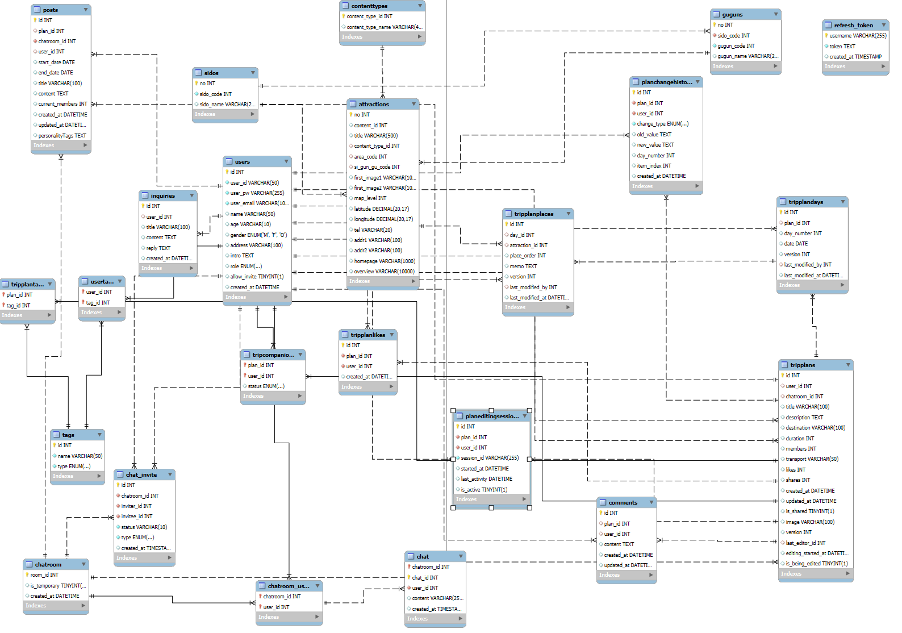
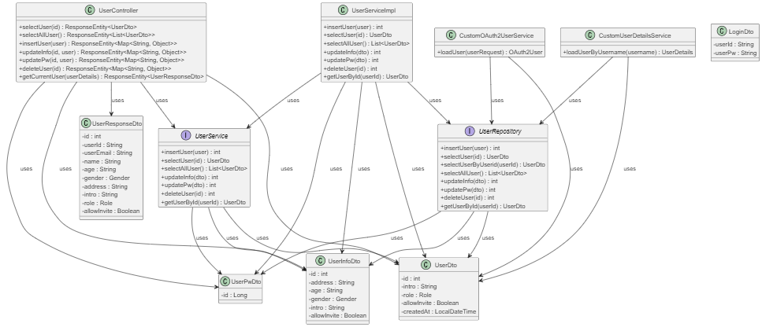
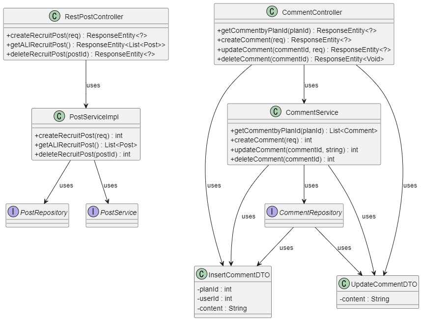

# Daejeon_5_13_finalproject_travelus

# 김찬기 유환태 vue 관통 - Travelus

### [👉🏻코딩 컨벤션 위키](https://lab.DB_PASSWORD_REDACTED.com/rlacksrl00/daejeon_5_13_finalproject_travelus/-/wikis/commit)
## 프로젝트 소개

바쁜 현대사회에서 친구들과 여행 일정을 맞추기란 쉽지 않으며, 혼자 여행을 떠나기엔 부담을 느끼는 사람들도 많습니다.

이 플랫폼은 사용자들이 자신의 일정에 맞는 여행 계획을 AI와 함께 손쉽게 생성하고, 유사한 여행 스타일을 가진 동행자를 찾아 함께 여행을 떠날 수 있도록 지원하는 **AI 기반 여행 플래너 및 동행 매칭 플랫폼**입니다.

### 요구사항 정의서

### Usecase Diagram

### 테이블 구조도(ERD) (동일한 내용)

### 클래스 다이어그램
#### User

#### TripPlan

#### Post

